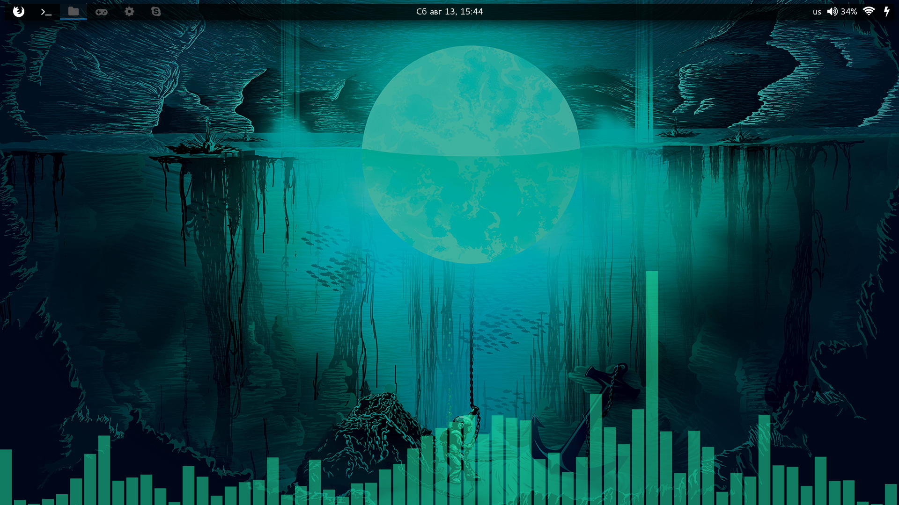
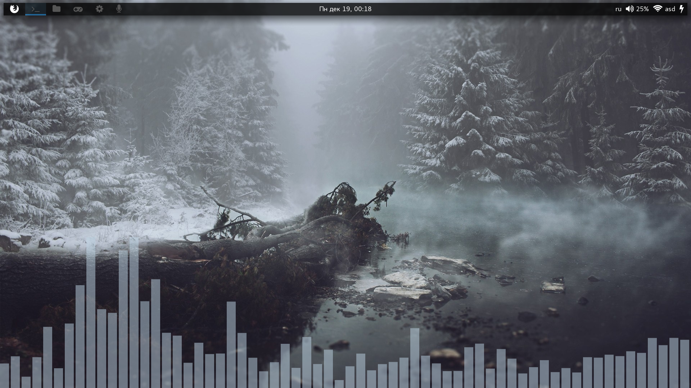

Spectrumyzer
==============




Dependencies
--------------

Make sure you have `git` and the full `gcc` stack installed, and then install the following packages: 

```
python2
cairo
python2-cairo
fftw
libpulse
```

Build
--------------

    git clone https://github.com/HaCk3Dq/spectrumyzer.git
    make

If this completes successfully, test with:

    ./spectrumyzer.py

And try to play some music

References
--------------
* https://github.com/rm-hull/raspberry-vu

* https://github.com/ianhalpern/Impulse
